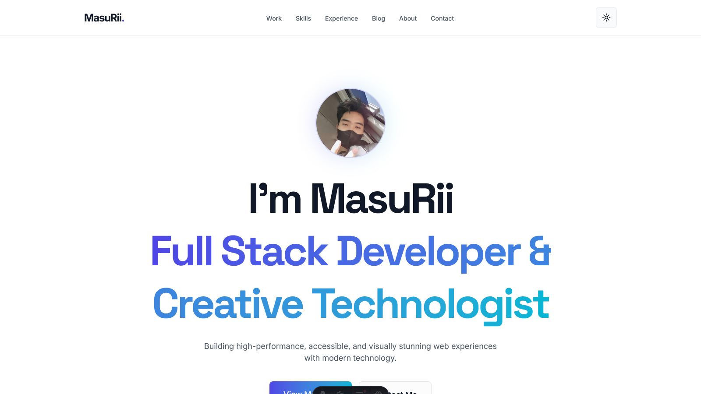

# Dev Portfolio Template

<div align="center">


[](https://github.com/MasuRii/dev-portfolio-template/actions)
[](https://github.com/MasuRii/dev-portfolio-template/actions/workflows/deploy.yml)
[](package.json)
[](CONTRIBUTING.md)

**A modern, high-performance developer portfolio template built with Astro, React, and Tailwind CSS.**



[🚀 Live Demo](https://masurii.github.io/dev-portfolio-template/) | [Documentation](#-documentation) | [Quick Start](#-quick-start)

</div>

---

## Features

- **Blazing Fast** - Built with Astro for optimal performance and minimal JavaScript
- **Modern Stack** - React 19, Tailwind CSS 4, and TypeScript for type safety
- **Smooth Animations** - Motion library for beautiful, accessible animations
- **Dark/Light Mode** - Theme toggle with system preference detection
- **Fully Responsive** - Mobile-first design that looks great on all devices
- **SEO Optimized** - Built-in sitemap, meta tags, and structured data
- **Accessibility First** - WCAG 2.1 AA compliant with keyboard navigation
- **Analytics Ready** - Vercel Analytics integration out of the box
- **Easy Customization** - JSON-based content management for quick updates

## Tech Stack

| Category             | Technology                                                |
| -------------------- | --------------------------------------------------------- |
| **Framework**        | [Astro](https://astro.build) v5.16.8                      |
| **UI Library**       | [React](https://react.dev) v19.2.3                        |
| **Styling**          | [Tailwind CSS](https://tailwindcss.com) v4.1.18           |
| **Animations**       | [Motion](https://motion.dev) v12.25.0                     |
| **State Management** | [Nanostores](https://github.com/nanostores/nanostores)    |
| **Icons**            | [Iconify](https://iconify.design) (Lucide + Simple Icons) |
| **Testing**          | [Vitest](https://vitest.dev)                              |
| **Deployment**       | [Vercel](https://vercel.com)                              |

## Quick Start

### Prerequisites

- [Node.js](https://nodejs.org) 18+ or [Bun](https://bun.sh) (recommended)
- [Git](https://git-scm.com)

### Installation

```bash
# Clone the repository
git clone https://github.com/MasuRii/dev-portfolio-template.git
cd dev-portfolio-template

# Install dependencies
bun install  # or npm install

# Copy environment variables
cp .env.example .env

# Start development server
bun dev  # or npm run dev
```

The site will be available at `http://localhost:4321`

## Commands

All commands are run from the root of the project:

| Command                 | Description                                |
| ----------------------- | ------------------------------------------ |
| `bun install`           | Install dependencies                       |
| `bun dev`               | Start local dev server at `localhost:4321` |
| `bun build`             | Build production site to `./dist/`         |
| `bun preview`           | Preview production build locally           |
| `bun run typecheck`     | Run TypeScript type checking               |
| `bun run lint`          | Run ESLint for code quality                |
| `bun run format`        | Run Prettier for code formatting           |
| `bun run test`          | Run unit tests with Vitest                 |
| `bun run test:coverage` | Generate test coverage report              |

## Project Structure

```
dev-portfolio-template/
├── public/                 # Static assets (favicon, robots.txt)
├── src/
│   ├── assets/            # Images and fonts
│   ├── components/
│   │   ├── common/        # Shared components (Header, Footer, etc.)
│   │   ├── sections/      # Page sections (Hero, About, Projects, etc.)
│   │   └── ui/            # UI components (Buttons, Cards, etc.)
│   ├── data/              # JSON content files
│   │   ├── personal.json  # Your personal info
│   │   ├── projects.json  # Portfolio projects
│   │   ├── skills.json    # Skills and technologies
│   │   ├── experience.json # Work experience
│   │   └── blog.json      # Blog posts
│   ├── layouts/           # Page layouts
│   ├── lib/               # Utility functions
│   ├── pages/             # Astro pages
│   ├── styles/            # Global CSS
│   ├── test/              # Test files
│   └── types/             # TypeScript types
├── .github/workflows/     # GitHub Actions CI/CD
├── .husky/                # Git hooks
└── package.json
```

## Customization

### Content

Edit the JSON files in `src/data/` to update your portfolio content:

- **`personal.json`** - Name, title, bio, social links, avatar
- **`projects.json`** - Portfolio projects with images, tech stack, links
- **`skills.json`** - Technical skills organized by category
- **`experience.json`** - Work history and education
- **`blog.json`** - Blog posts and articles
- **`navigation.json`** - Navigation menu items

### Styling

The project uses Tailwind CSS with a custom design system. Key customization points:

- Colors and theme variables in `src/styles/global.css`
- Component-specific styles in their respective `.astro` files

## Environment Variables

| Variable               | Description                                | Example                           |
| ---------------------- | ------------------------------------------ | --------------------------------- |
| `SITE`                 | Your site's full URL (for SEO and sitemap) | `https://masurii.dev`             |
| `PUBLIC_EMAIL`         | Public contact email displayed on site     | `hello@masurii.dev`               |
| `PUBLIC_FORM_ENDPOINT` | (Optional) Form submission API endpoint    | `https://api.formcarry.com/s/xyz` |

Copy `.env.example` to `.env` and update the values for your deployment.

## Deployment

This project supports both **GitHub Pages** and **Vercel** deployment:

### GitHub Pages (Automatic)

1. Push your code to GitHub
2. Enable GitHub Pages in repository settings (Settings → Pages → Source: GitHub Actions)
3. The included workflow will automatically build and deploy on every push to `main`
4. Your site will be available at `https://<username>.github.io/<repo-name>/`

### Vercel

1. Push your code to GitHub
2. Import the repository in [Vercel](https://vercel.com)
3. Set environment variables in Vercel dashboard
4. Deploy!

For other platforms, run `bun build` and deploy the `dist/` folder.

## Documentation

For detailed information on customizing your portfolio, refer to the [Content](#customization) section above.

## Contributing

Contributions are welcome! Please read our [Contributing Guidelines](./CONTRIBUTING.md) before submitting a pull request.

We follow:

- [Conventional Commits](https://www.conventionalcommits.org/) for commit messages
- Git Flow branching strategy
- ESLint and Prettier for code style

---

<div align="center">

**Built with love by [MasuRii](https://github.com/MasuRii)**

If you found this helpful, please consider giving it a star!

[](https://github.com/MasuRii/dev-portfolio-template)

</div>
